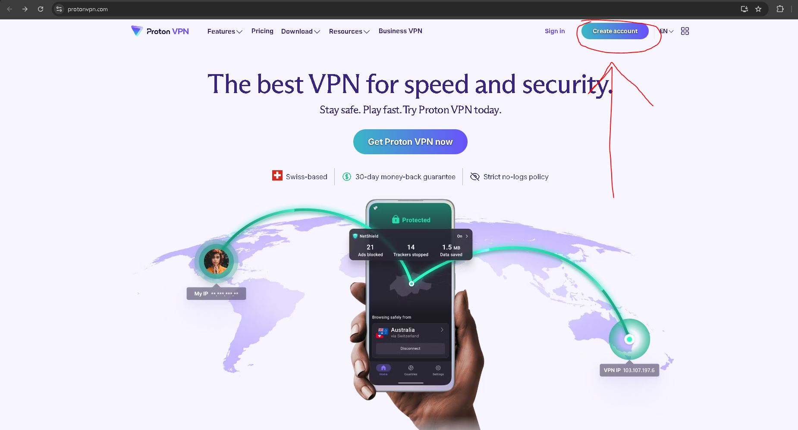

<h1>How to Use a VPN and Verify Your Connection</h1>
-In this tutorial, we'll cover how to set up a VPN (Virtual Private Network) on your device and check that you are connected successfully. 

<h2>Utilities and Tools Needed:</h5>

-   **ProtonVPN** (Virtual Private Network)
-   **Web Browser**- Used for accessing websites like whatismyipaddress.com and geolocation.com to verify IP address and location.
-   **Windows 10 Operating System-** Microsoft OS
-   **Internet Connection-** A stable internet connection is necessary for downloading the VPN application and for VPN functionality.

<h5>Environments and Technologies Used</h2>

-   **Windows 10 OS**
-   **VPN (Virtual Private Network)**
-   **Encryption**
-   **Remote Servers**

<h2>Program Walk-Through</h2>
I. Choose a reputable VPN Provider (e.g., NordVPN, ExpressVPN, CyberGhost, ProtonVPN) and sign up.

**\*This Tutorial chose ProtonVPN and will only contain images using this VPN Service\***

\-Visit the website of your chosen VPN provider and sign up for a plan

([Https://protonvpn.com](https://protonvpn.com/))

II. -Log in using the username and password you created when signing up. \*Download and Install the correct version of the VPN Application for your OS

III. -Launch application and Connect to a VPN Server

\*Within the app, browse the list of available server locations.

Select one based on your needs (e.g., closer for speed, or a specific country for content access). Click the “Quick Connect” button for a random fast connection.

*Wait for the app to establish a connection. This may take a few seconds.*

IV. -Verify Your VPN Connection and Check Connection Status

\*Look for a message/connection meter indicating that you are connected, most VPN apps display some form of “Connected” status, often with the server location shown.

<h2>Verify Your Connection</h2>

I. -Open your web browser and visit https://whatismyipaddress.com/

*\*Note your IP address displayed on the site. It should match the location of the VPN server you connected to.*

<h2>Diconnect</h2>

I. -Disconnect from the VPN, when you're done browsing securely, return to the VPN application and click the “Disconnect” button to end your session.

II. -Use the VPN regularly, connect to the VPN whenever you use public Wi-Fi or want to enhance your online privacy.

*\*Regularly check for updates to the VPN app to ensure you have the latest features and security improvements.*

<h2>Conclusion</h2>

\-Congratulations! You have successfully set up and connected to a VPN for regular use, connect to the VPN whenever you use public Wi-Fi or want to enhance your online privacy. Thank you for taking the time to read though this guide.

Created by: Fernando Tapia-Rios

*\*Do NOT the rights to any images used above\**
